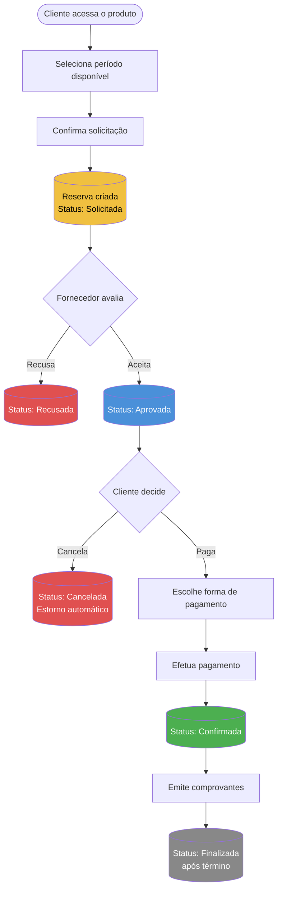
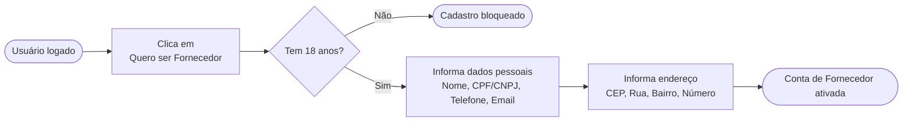
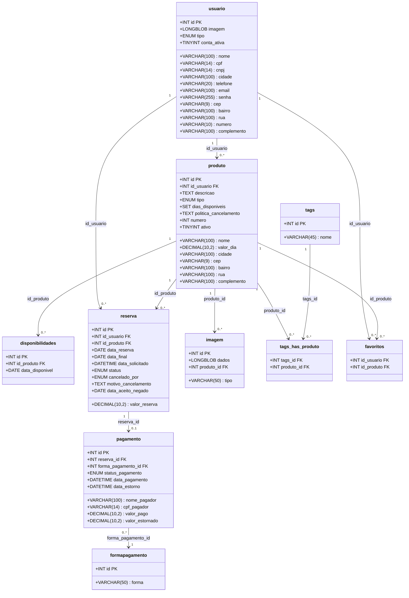

<div align="center">

<h1>🏠 Louer</h1>
<p><strong>Marketplace de aluguel de equipamentos e espaços</strong></p>

<p>
  
  
</p>

<p>
  <a href="#sobre">Sobre</a> •
  <a href="#funcionalidades">Funcionalidades</a> •
  <a href="#fluxo-do-sistema">Fluxo</a> •
  <a href="#banco-de-dados">Banco de Dados</a> •
  <a href="#tecnologias">Tecnologias</a> •
  <a href="#equipe">Equipe</a>
</p>

</div>

---

## Sobre

O **Louer** é um marketplace web que conecta clientes e fornecedores para o aluguel de equipamentos e espaços. O projeto nasceu da necessidade de centralizar e simplificar um processo hoje feito de forma dispersa — como o agendamento manual de quadras públicas em Colatina (ES).

Desenvolvido como **Trabalho de Conclusão de Curso** do Técnico em Informática para a Internet integrado ao Ensino Médio, no **TECgirls / IFES Colatina**, 2025.

### Objetivo

Funcionar como um intermediário digital entre quem tem algo para alugar e quem precisa alugar — seja um vestido, um teclado musical ou uma quadra poliesportiva.

---

## Funcionalidades

### 👤 Cliente
- Cadastro, login, edição e exclusão de conta
- Busca e visualização de produtos
- Solicitação de reservas com seleção de período
- Acompanhamento de status da reserva em tempo real
- Realização de pagamento (PIX, cartão de crédito e débito)
- Emissão de comprovante de pagamento e de reserva
- Histórico completo de aluguéis
- Lista de produtos favoritos

### 🏪 Fornecedor
- Cadastro como fornecedor (requer 18+ anos)
- Cadastro de espaços e equipamentos com disponibilidade
- Aceitação ou recusa de solicitações de reserva
- Cancelamento de reservas
- Edição e exclusão de produtos

---

## Fluxo do Sistema

### Jornada de Reserva



### Cadastro de Fornecedor



---

## Diagrama de Classes



---

## Banco de Dados

O banco utilizado é **MySQL**, com o schema `louerbd`. Abaixo estão todas as tabelas com suas colunas principais:

| Tabela | Colunas principais | Descrição |
|---|---|---|
| `usuario` | `id`, `nome`, `tipo` (Cliente/Fornecedor/Gerente), `cpf`, `cnpj`, `email`, `senha`, `cidade`, `cep`, `conta_ativa` | Todos os usuários do sistema |
| `produto` | `id`, `id_usuario`, `nome`, `descricao`, `tipo` (Espaco/Equipamento), `valor_dia`, `dias_disponiveis`, `politica_cancelamento`, `ativo` | Espaços e equipamentos anunciados |
| `disponibilidades` | `id`, `id_produto`, `data_disponivel` | Datas disponíveis para cada produto |
| `reserva` | `id`, `id_usuario`, `id_produto`, `data_reserva`, `data_final`, `valor_reserva`, `status`, `cancelado_por`, `motivo_cancelamento`, `data_aceito_negado` | Solicitações e reservas realizadas |
| `pagamento` | `id`, `reserva_id`, `forma_pagamento_id`, `nome_pagador`, `cpf_pagador`, `valor_pago`, `valor_estornado`, `status_pagamento`, `data_pagamento`, `data_estorno` | Registros de pagamentos e estornos |
| `formapagamento` | `id`, `forma` | PIX, Cartão de Crédito, Cartão de Débito |
| `imagem` | `id`, `dados`, `tipo`, `produto_id` | Imagens vinculadas aos produtos |
| `tags` | `id`, `nome` | Categorias: Quadra, Musical, Esporte, Roupa, etc. |
| `tags_has_produto` | `tags_id`, `produto_id` | Relação N:N entre tags e produtos |
| `favoritos` | `id_usuario`, `id_produto` | Produtos favoritados por usuários |

Os scripts completos de criação e população estão em [`banco-de-dados/`](./banco-de-dados/).

---

## Regras de Negócio

- Acesso ao sistema somente via **login e senha**
- Apenas fornecedores podem cadastrar produtos
- Reservas recusadas ou canceladas **não são excluídas**, apenas marcadas com o status correspondente
- O **estorno é automático** caso o fornecedor cancele uma reserva confirmada
- O valor só é repassado ao fornecedor **após o término do aluguel**
- Apenas **datas livres** ficam disponíveis para seleção durante a solicitação
- Para se tornar fornecedor é necessário ter **18 anos ou mais**

---

## Status das Reservas

```
Solicitada → Aprovada → Confirmada → Finalizada
     │            │
     ↓            ↓
  Recusada     Cancelada
```

---

## Tecnologias

> As tecnologias utilizadas no desenvolvimento podem ser verificadas no repositório de código.

- **Frontend:** Web (acessível via navegador)
- **Banco de Dados:** MySQL
- **Infraestrutura:** Terraform — [repositório louertf](https://github.com/kikiscar/louertf)

---

## Repositórios

| Repositório | Link |
|---|---|
| 💻 Código-fonte | [github.com/holzdm/louer](https://github.com/holzdm/louer) |
| ☁️ Infraestrutura (Terraform) | [github.com/kikiscar/louertf](https://github.com/kikiscar/louertf) |

---

## Equipe

Desenvolvido com 💙 pela equipe **TECgirls** — Turma do Técnico em Informática para a Internet, IFES Colatina, 2025.

| Nome | GitHub |
|---|---|
| Carolina Faria Cassaro | — |
| Kiara Piontkovsky Scardini | [@kikiscar](https://github.com/kikiscar) |
| Vítor Holz De Martin | [@holzdm](https://github.com/holzdm) |

---

<div align="center">
  <sub>© 2025 Louer — Alugue espaços e itens de forma simples.</sub>
</div>
